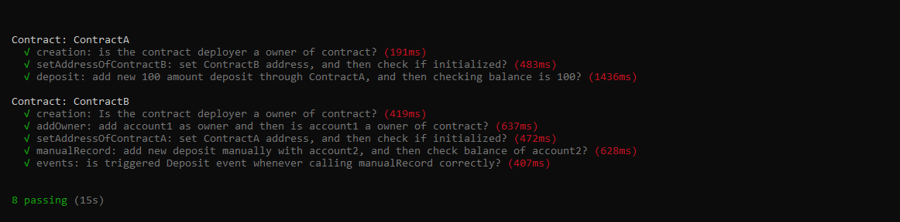

[ERC20Token(template): 0x99ab900c60c90aef9ff25bc812dabf3616727b16](https://kovan.etherscan.io/address/0x99ab900c60c90aef9ff25bc812dabf3616727b16)

[ContractA: 0x87bA14c19a57ae292C3011CdB6Be3f6B5D19e38F](https://kovan.etherscan.io/address/0x87bA14c19a57ae292C3011CdB6Be3f6B5D19e38F)

[ContractB: 0x69e968f1653443c9d711a0e7c629cbfa45b656a0](https://kovan.etherscan.io/address/0x69e968f1653443c9d711a0e7c629cbfa45b656a0)

## Step 1: Install all dependencies

```sh
npm install
```
## Step 2: Testing contracts

```sh
truffle test
```

## Step 3: Deploying contract on Kovan test network

```sh
truffle migration --network kovan
```
